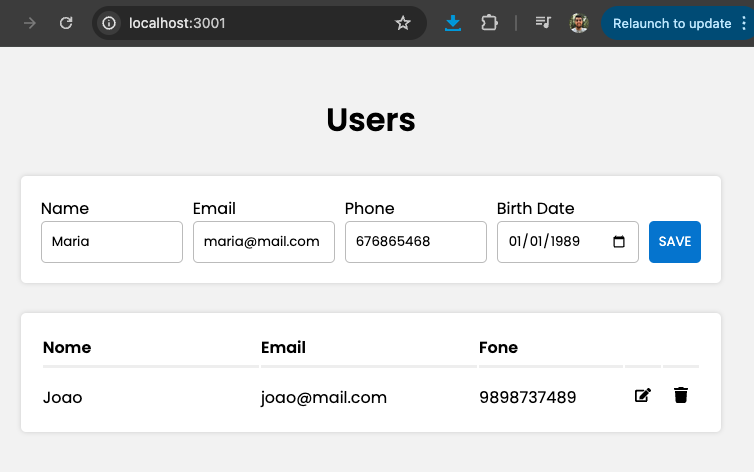
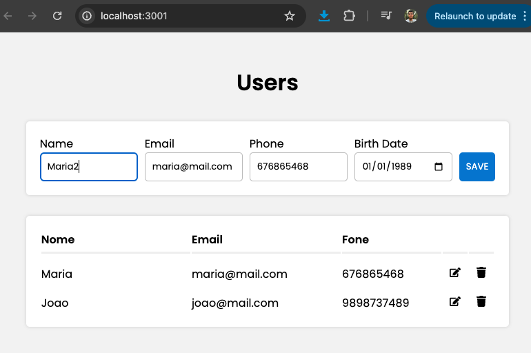
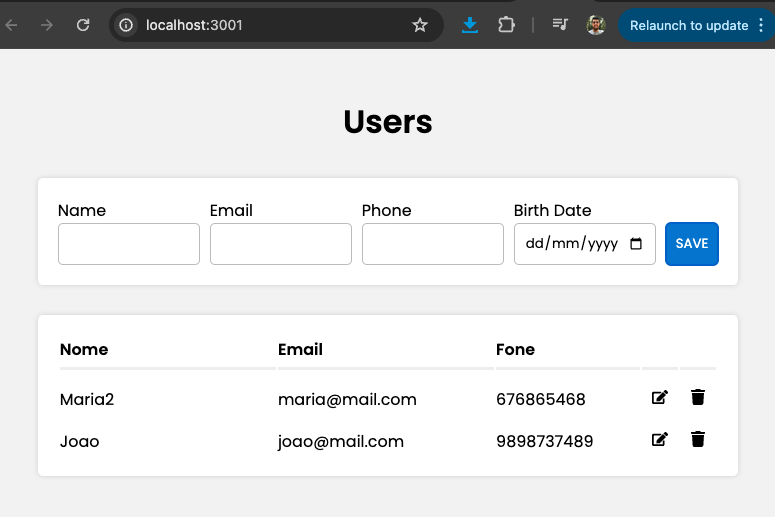

# Getting Started with Create React App

This project was bootstrapped with [Create React App](https://github.com/facebook/create-react-app).

Projeto simples de CRUD utilzando Javascript: NodeJs no backend e ReactJS no frontend, tendo como banco de dados o MySQL.

App de cadastro de nome com retorno das informações em uma tabela, podendo ser editado e excluído.

Créditos: Aula dispnivel no youtube (https://www.youtube.com/watch?v=voXTVTW73E8&list=WL&index=11)